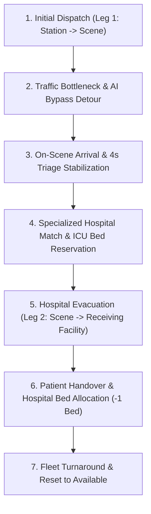

# 🚨 NeuralNexus: Crisis Command & AI Emergency Control Room

> **ResQAlloc / Crisis Command:** Autonomous Multi-Agent Dynamic Emergency Response, Live Geospatial Dispatch & Resource Reallocation System.  
> Built for mission-critical disaster response, urban traffic gridlock bypass, and dynamic Human-in-the-Loop (HITL) fleet reallocations.

---

## 📑 Table of Contents
1. [System Overview & Architecture](#-system-overview--architecture)
2. [Key Capabilities & Working Mechanism](#-key-capabilities--working-mechanism)
3. [Emergency Dispatch-to-Hospital 7-Step Lifecycle](#-emergency-dispatch-to-hospital-7-step-lifecycle)
4. [Project Structure](#-project-structure)
5. [Quick Start & Running Instructions](#-quick-start--running-instructions)
6. [Available Scripts](#-available-scripts)
7. [API & WebSocket Event Specifications](#-api--websocket-event-specifications)
8. [Environment Variables](#-environment-variables)
9. [Geospatial Mathematics Engine](#-geospatial-mathematics-engine)

---

## 🌐 System Overview & Architecture

NeuralNexus is an enterprise-grade emergency dispatch and multi-agent coordination platform designed to eliminate critical "Golden Hour" response delays during urban crises.

```text
┌──────────────────────────────────────────────────────────────────────────────┐
│                            NEURALNEXUS ARCHITECTURE                          │
├──────────────────────────────────────────────────────────────────────────────┤
│                                                                              │
│   ┌──────────────────────────────────────────────────────────────────────┐   │
│   │               Frontend Client (React 19 + Vite + Mapbox GL)          │   │
│   │                                                                      │   │
│   │   • 100vw x 100vh Tactical Mapbox GIS Canvas with 3D Buildings       │   │
│   │   • 60fps Arc-Length Parameterized Vehicle Animation & Steering      │   │
│   │   • Multi-Agent Live Reasoning Telemetry Stream                      │   │
│   │   • Floating Incident, Fleet & Bed Capacity Drawers                  │   │
│   │   • Human-in-the-Loop (HITL) Priority Reallocation Modal             │   │
│   │   • Scenario Pitch Dock & Variable Playback Controls (0.5x, 1x, 2x)  │   │
│   └───────────────────────────────────▲──────────────────────────────────┘   │
│                                       │                                      │
│                         HTTP & WebSocket (Socket.IO)                         │
│                     [Port 5000: State Streams & Audits]                      │
│                                       │                                      │
│   ┌───────────────────────────────────▼──────────────────────────────────┐   │
│   │             Backend Multi-Agent Engine (Node.js + Express)           │   │
│   │                                                                      │   │
│   │   • Command Agent: Golden Hour utility optimization & priority triage│   │
│   │   • Logistics Agent: Traffic gridlock detection & dynamic detours    │   │
│   │   • Triage Agent: Specialty hospital matching & ICU bed reservation  │   │
│   │   • Allocation Sentinel: Atomic assignment locks & preemption audits │   │
│   └───────────────────────────────────▲──────────────────────────────────┘   │
│                                       │                                      │
│   ┌───────────────────────────────────▼──────────────────────────────────┐   │
│   │                    Shared Domain Contracts & Types                   │   │
│   │         [@neuralnexus/shared: Coordinates, Incident, Resource]        │   │
│   └──────────────────────────────────────────────────────────────────────┘   │
└──────────────────────────────────────────────────────────────────────────────┘
```

---

## ⚡ Key Capabilities & Working Mechanism

### 1. Full-Screen 100vw x 100vh Mapbox Geospatial Canvas
- High-performance Mapbox GL canvas rendering the entire Bengaluru metropolitan area with custom dark vector styling.
- Interactive camera controls (pitch, bearing, 3D building extrusions, live traffic layer overlay).
- Tactical glassmorphic floating HUD overlays (Incident Drawer, Fleet Inventory, Agent Telemetry Stream, and Scenario Presentation Controls).

### 2. 60fps Arc-Length Parameterized Vehicle Movement
- Real-time vehicle animation using cumulative Haversine distance arc-length parameterization (`slicePolylineAtProgress`).
- Eliminates erratic speed jumps across uneven GPS nodes, maintaining a consistent, realistic emergency speed.
- Shortest-arc heading steering (`lerpAngle`) ensures vehicles smoothly navigate street curves and intersections without angular snapping or 360° flip artifacts.
- Visual beacons with pulsating siren halos and directional forward compass beams.

### 3. Dynamic Traffic Jam Detection & AI Bypass
- Real-time traffic congestion monitoring identifies arterial bottlenecks.
- The system renders congested segments in high-visibility glowing red (`#ef4444`) while instantly calculating and deploying dynamic bypass vectors in amber (`#f59e0b`), saving up to 8.8 minutes of critical transit time.

### 4. Human-in-the-Loop (HITL) Safety Gateway
- When a higher-severity crisis (e.g., Severity 5 Multi-Vehicle Crash) occurs while fleet units are already dispatched to lower-priority calls, the Gemini-powered Command Agent generates a preemptive reallocation proposal.
- A modal presents the commander with quantitative Golden Hour time savings, risk evaluations, and trade-off justifications before confirming any diversion.

---

## 🔄 Emergency Dispatch-to-Hospital 7-Step Lifecycle

NeuralNexus executes a complete end-to-end 7-step lifecycle:



| Step | Stage Name | Visual State & Action | Route Color & Vector |
| :--- | :--- | :--- | :--- |
| **1** | **Initial Dispatch** | Fire Engine and ALS Ambulances dispatched to primary structural fire incident. | Neon Sky Blue (`#38bdf8`) Leg 1 Corridor |
| **2** | **Traffic Bypass** | Arterial gridlock detected on Hosur Rd (+11 min delay); ALS unit redirected via dynamic bypass. | Congested Red (`#ef4444`) + Amber (`#f59e0b`) Detour |
| **3** | **On-Scene Triage** | Unit arrives at incident scene; pauses for 4.0s with floating `[ON SCENE: STABILIZING PATIENT]` badge. | Vehicle parked on scene with active triage aura |
| **4** | **Specialty Matching** | Incident matched to receiving facility (e.g., Burn ICU Hub at Victoria Hospital). | Facility specialty lock & ICU reservation |
| **5** | **Hospital Evacuation** | Code-3 evacuation begins along high-density road vector to receiving emergency bay. | Deep Cobalt Blue (`#2563eb`) Leg 2 Corridor |
| **6** | **Patient Delivered** | Ambulance reaches hospital gate; receiving facility available bed count decrements (-1 bed). | Hospital arrival alert & handover confirmation |
| **7** | **Fleet Reset** | Patient transferred; unit resets to `AVAILABLE` for redeployment. | Unit returns to patrol or standby status |

---

## 📁 Project Structure

```text
NeuralNexus/
├── frontend/                   # 🌐 React 19 + Vite + Mapbox GL Emergency UI
│   ├── src/
│   │   ├── components/
│   │   │   ├── layout/         # TopNav (telemetry header), DemoControls (scenario dock)
│   │   │   ├── map/            # MapView (Mapbox canvas), MapMarkers, RouteLayers, TrafficLayers
│   │   │   ├── modals/         # ApprovalModal (HITL verification gate)
│   │   │   └── panels/         # IncidentDrawer, FleetDrawer, AgentTelemetry stream
│   │   ├── data/               # mockBengaluruState.ts, roadRoutes.ts (high-density waypoints)
│   │   ├── hooks/              # useEmergencyState.ts (master lifecycle & Socket.IO client)
│   │   ├── types/              # emergency.ts (strictly typed contracts)
│   │   ├── utils/              # geoUtils.ts (Haversine distance, arc-length slicer, bearing)
│   │   ├── App.tsx             # Main full-screen application layout
│   │   ├── index.css           # Tactical design tokens, glassmorphism, animations
│   │   └── main.tsx            # React root entrypoint
│   ├── package.json
│   ├── tsconfig.json
│   └── vite.config.ts
│
├── backend/                    # ⚙️ Node.js + Express + Socket.IO Multi-Agent API
│   ├── src/
│   │   ├── models/             # Mongoose schemas (Incident, Resource, Assignment, DecisionLog)
│   │   ├── services/           # socketService.ts (Socket.IO events, state broadcasting, HITL)
│   │   └── server.ts           # Express server, CORS setup, health check endpoint
│   ├── package.json
│   └── tsconfig.json
│
├── shared/                     # 📦 Common TypeScript interfaces shared across packages
│   ├── src/
│   │   └── index.ts            # Shared types (Coordinates, Incident, Resource, RouteGeometry)
│   ├── package.json
│   └── tsconfig.json
│
├── package.json                # 🚀 Root monorepo orchestration script
└── README.md                   # Comprehensive documentation
```

---

## 🚀 Quick Start & Running Instructions

### Prerequisites
- **Node.js**: v18.0.0 or higher
- **npm**: v9.0.0 or higher

---

### Method A: Single-Command Full Stack (Recommended)

From the project root:

```bash
# 1. Install all dependencies across monorepo packages
npm run install:all

# 2. Start both Backend (Port 5000) and Frontend (Port 5173) concurrently
npm run dev
```

- **Frontend Application:** [http://localhost:5173](http://localhost:5173)
- **Backend API & Socket.IO:** [http://localhost:5000](http://localhost:5000)
- **Backend Health Check:** [http://localhost:5000/health](http://localhost:5000/health)

---

### Method B: Running Services Separately

#### 1. Backend Server (`backend/`)
```bash
cd backend
npm install
npm run dev
```
*Starts the Express server & Socket.IO stream on `http://localhost:5000`.*

#### 2. Frontend Client (`frontend/`)
```bash
cd frontend
npm install
npm run dev
```
*Starts the Vite dev server with Hot Module Replacement on `http://localhost:5173`.*

---

## 🛠 Available Scripts

| Command | Working Directory | Description |
| :--- | :--- | :--- |
| `npm run dev` | Root | Runs backend and frontend concurrently with unified colored terminal logging |
| `npm run dev:frontend` | Root | Starts frontend Vite dev server |
| `npm run dev:backend` | Root | Starts backend server with auto-reload (`tsx watch`) |
| `npm run build` | Root | Compiles shared, frontend, and backend packages for production (TypeScript + Vite) |
| `npm run build:frontend` | Root | Compiles frontend production bundle |
| `npm run build:backend` | Root | Compiles backend TypeScript to `dist/` |
| `npm run install:all` | Root | Installs dependencies across root, shared, frontend, and backend |

---

## 📡 API & WebSocket Event Specifications

### REST Endpoints

| Method | Endpoint | Description |
| :--- | :--- | :--- |
| `GET` | `/health` | Health-check endpoint returning service status and timestamp. |
| `GET` | `/api/state` | Returns the current snapshot of all active incidents, resources, and routes. |
| `POST` | `/api/seed` | Resets and re-seeds database with benchmark Bengaluru scenarios. |
| `PATCH` | `/api/resources/:id/status` | Updates vehicle status (e.g. `AVAILABLE`, `OUT_OF_SERVICE`, `DISPATCHED`). |
| `POST` | `/api/assignments/approve` | Commits dispatcher approval for resource reallocations. |

### Socket.IO Real-Time Stream Events

| Direction | Event Name | Payload Description |
| :--- | :--- | :--- |
| **Server ➔ Client** | `agent_status` | Emits active multi-agent status (`ONLINE`) upon connection. |
| **Server ➔ Client** | `state_update` | Emits full world state updates when incidents or fleet positions change. |
| **Server ➔ Client** | `approval_required` | Emits reallocation proposal requiring human dispatcher sign-off. |
| **Client ➔ Server** | `approve_reallocation` | Sends dispatcher approval `{ incidentId, resourceId, timestamp }`. |
| **Server ➔ Client** | `approval_confirmed` | Broadcasts confirmed reallocation with decision log to all dashboards. |
| **Client ➔ Server** | `reject_reallocation` | Sends operator override rejection `{ incidentId }`. |
| **Server ➔ Client** | `approval_rejected` | Broadcasts cancellation and logs operator override. |

---

## 🔑 Environment Variables

### Frontend (`frontend/.env`)
```env
# Optional Mapbox public access token (fallback token included for instant demo)
VITE_MAPBOX_TOKEN=pk.eyJ1IjoiZGV2LWVtZXJnZW5jeSIsImEiOiJjbHN2eGJ0MWgwMHF5MmtwZnlicTFleDZtIn0.placeholder

# Backend WebSocket URL
VITE_WS_URL=http://localhost:5000
```

### Backend (`backend/.env`)
```env
PORT=5000
NODE_ENV=development
MONGO_URI=mongodb://127.0.0.1:27017/resqalloc?directConnection=true
```

---

## 📐 Geospatial Mathematics Engine

The frontend geospatial engine in [`geoUtils.ts`](file:///e:/gateways/NeuralNexus/frontend/src/utils/geoUtils.ts) utilizes spherical trigonometry for accurate road interpolation:

### 1. Great-Circle Haversine Distance
$$\Delta\sigma = 2 \arcsin\left(\sqrt{\sin^2\left(\frac{\Delta\phi}{2}\right) + \cos(\phi_1)\cos(\phi_2)\sin^2\left(\frac{\Delta\lambda}{2}\right)}\right)$$
$$d = R \cdot \Delta\sigma \quad (\text{where } R = 6371\text{ km})$$

### 2. Forward Compass Bearing
$$\theta = \text{atan2}\left(\sin(\Delta\lambda)\cos(\phi_2), \; \cos(\phi_1)\sin(\phi_2) - \sin(\phi_1)\cos(\phi_2)\cos(\Delta\lambda)\right)$$

### 3. Shortest-Arc Angular Steering Interpolation (`lerpAngle`)
$$\text{diff} = ((\text{target} - \text{current} + 540) \pmod{360}) - 180$$
$$\text{smoothedBearing} = (\text{current} + \text{diff} \cdot \alpha + 360) \pmod{360}$$

---

## 🏆 Presentation & Live Demonstration Tips

1. **Full-Screen Immersion**: Open [http://localhost:5173](http://localhost:5173). The interface automatically expands to fill your entire viewport with responsive tactical overlays.
2. **Interactive Scenarios**: Use the bottom presentation dock to trigger **1. Normal Dispatch**, **2. Traffic Gridlock & Bypass**, and **3. Hospital Evacuation (Leg 2)**.
3. **Variable Speed**: Toggle between `0.5x Slow`, `1.0x Normal`, and `2.0x Fast` to demonstrate high-speed decision-making or slow-motion turn-by-turn steering.
4. **Live Backend Mode**: Toggle the badge in the top-right navbar from **MOCK DATA** to **LIVE WS** to connect to the Node.js backend.