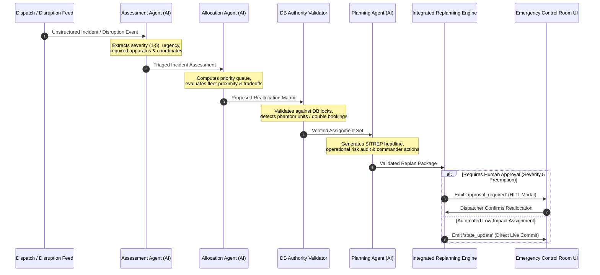
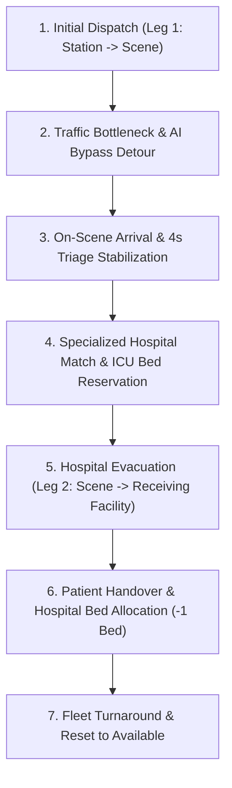

# 🚨 NeuralNexus: Autonomous Multi-Agent Emergency Crisis & Dynamic Control Room

> **ResQAlloc / NeuralNexus:** Autonomous Multi-Agent Dynamic Emergency Response, Real-Time Geospatial Dispatch & Fleet Reallocation System.  
> Engineered to eliminate critical "Golden Hour" response delays during urban crises through AI multi-agent triage, traffic bottleneck bypass routing, and Human-in-the-Loop (HITL) preemption authorization.

---

## 📑 Table of Contents
1. [System Overview & Architecture](#-system-overview--architecture)
2. [Multi-Agent AI Pipeline (Gemini 2.5 Flash)](#-multi-agent-ai-pipeline-gemini-25-flash)
3. [Key Capabilities & Innovations](#-key-capabilities--innovations)
4. [Emergency Dispatch-to-Hospital 7-Step Lifecycle](#-emergency-dispatch-to-hospital-7-step-lifecycle)
5. [Monorepo Project Structure](#-monorepo-project-structure)
6. [Quick Start & Installation](#-quick-start--installation)
7. [Environment Configuration](#-environment-configuration)
8. [Available Scripts & Testing Suites](#-available-scripts--testing-suites)
9. [API & WebSocket Event Specifications](#-api--websocket-event-specifications)
10. [Geospatial Mathematics Engine](#-geospatial-mathematics-engine)
11. [Live Demonstration & Judge Walkthrough](#-live-demonstration--judge-walkthrough)

---

## 🌐 System Overview & Architecture

NeuralNexus functions as an autonomous, cybernetic Emergency Operations Center (EOC). It coordinates emergency response teams, calculates dynamic detour vectors around severe arterial gridlocks, and coordinates triage allocations across municipal hospital ICU networks.

```text
┌────────────────────────────────────────────────────────────────────────────────────────┐
│                                NEURALNEXUS SYSTEM ARCHITECTURE                         │
├────────────────────────────────────────────────────────────────────────────────────────┤
│                                                                                        │
│   ┌────────────────────────────────────────────────────────────────────────────────┐   │
│   │              Frontend Client (React 19 + TypeScript + Vite + Mapbox GL)        │   │
│   │                                                                                │   │
│   │   • 100vw x 100vh Tactical Mapbox Canvas with 3D Building Extrusions & Pitch   │   │
│   │   • 60fps Arc-Length Parameterized Vehicle Animation & Shortest-Arc Steering   │   │
│   │   • Multi-Agent Real-Time Reasoning Telemetry Terminal (TRI/LOG/ALC/CMD)       │   │
│   │   • Left Incident Queue Drawer & Right Fleet Inventory Gauges (Hover-Slide)    │   │
│   │   • Human-in-the-Loop (HITL) Preemptive Reallocation Approval Modal            │   │
│   │   • Mission Control Dock: Variable Speeds (0.5x, 1x, 2x, 4x) & Scenario Matrix │   │
│   └───────────────────────────────────────▲────────────────────────────────────────┘   │
│                                           │                                            │
│                             HTTP REST & Socket.IO WebSockets                           │
│                          [Port 5000: Full-Duplex Live Streaming]                       │
│                                           │                                            │
│   ┌───────────────────────────────────────▼────────────────────────────────────────┐   │
│   │           Backend Multi-Agent Engine (Node.js + Express + TypeScript)          │   │
│   │                                                                                │   │
│   │   ┌───────────────────┐     ┌───────────────────┐     ┌───────────────────┐    │   │
│   │   │ Assessment Agent  │ ──► │ Allocation Agent  │ ──► │ Validator Guard   │    │   │
│   │   │ (Gemini Triage)   │     │ (Constraint Match)│     │ (DB Authority)    │    │   │
│   │   └───────────────────┘     └───────────────────┘     └─────────┬─────────┘    │   │
│   │                                                                 │              │   │
│   │   ┌───────────────────┐     ┌───────────────────┐               ▼              │   │
│   │   │ Dynamic Replan    │ ◄── │ Planning Agent    │ ◄─────────────┘              │   │
│   │   │ (State Manager)   │     │ (SITREP & Risks)  │                              │   │
│   │   └───────────────────┘     └───────────────────┘                              │   │
│   └───────────────────────────────────────▲────────────────────────────────────────┘   │
│                                           │                                            │
│   ┌───────────────────────────────────────▼────────────────────────────────────────┐   │
│   │                       Shared Monorepo Domain Contracts                         │   │
│   │            [@shared/emergency: Coordinates, Incident, Resource, Routes]        │   │
│   └────────────────────────────────────────────────────────────────────────────────┘   │
└────────────────────────────────────────────────────────────────────────────────────────┘
```

---

## 🤖 Multi-Agent AI Pipeline (Gemini 2.5 Flash)

NeuralNexus integrates a sequential multi-agent AI pipeline built on Google's `@google/genai` SDK and powered by `gemini-2.5-flash`:



### Agent Roles & Guardrails

1. **Assessment Agent (`assessmentAgent.ts`)**:
   - Parses noisy emergency dispatches into clinical severity classifications (1–5), urgency ratings (`low`, `medium`, `high`, `critical`), required resource types (`ambulance`, `fire`, `rescue`, `hazmat`), and geocoded locations.
2. **Allocation Agent (`allocationAgent.ts`)**:
   - Solves multi-incident resource contention by maximizing clinical survival probability and minimizing travel times, providing quantitative trade-off justifications.
3. **Database Authority Guardrail (`validator.ts`)**:
   - Acts as a strict schema and state validator that prevents AI hallucinations, eliminates duplicate bookings, and ensures only registered fleet resources in the database can be dispatched.
4. **Planning Agent (`planningAgent.ts`)**:
   - Synthesizes operational insights into executive Situation Reports (SITREPs), identifies systemic traffic/weather risks, and formulates strategic recommendations for human commanders.
5. **Integrated Replanning Engine (`integratedReplanningEngine.ts`)**:
   - Evaluates whether an event (`RESOURCE_UNAVAILABLE`, `TRAFFIC_CONGESTION`, `NEW_INCIDENT`) can be handled automatically or requires Human-in-the-Loop (HITL) approval.

---

## ⚡ Key Capabilities & Innovations

### 1. 100vw x 100vh 3D Tactical Mapbox Canvas
- **Immersive Viewport**: High-contrast, dark cybernetic vector map of Bengaluru metropolitan area with zero wasted screen space.
- **3D Tactical Perspective**: One-click 3D camera toggle adding 45° pitch and dynamic bearing perspective to observe 3D building extrusions and elevation layers.
- **Dynamic Traffic Congestion Layer**: Real-time arterial flow visualization highlighting live gridlocks and bypass corridors.

### 2. 60fps Arc-Length Parameterized Vehicle Animation
- **Continuous Velocity Interpolation**: Uses cumulative Haversine distance arc-length parameterization (`slicePolylineAtProgress`) to eliminate speed spikes across irregular waypoint densities.
- **Shortest-Arc Angular Steering (`lerpAngle`)**: Vehicles smoothly rotate through corners without 360° flip artifacts or angular snapping.
- **Pulsating Sirens & Forward Beacons**: Real-time visual halos and heading rays communicate emergency vehicle priority on the road.

### 3. Dynamic Traffic Jam Detection & AI Bypass Routing
- Instant identification of arterial bottlenecks on major transit routes (e.g., Hosur Road corridor).
- Renders gridlocked roads in high-visibility neon red (`#FF2A3B`) and automatically deploys optimal amber bypass routes (`#F59E0B`), shaving up to **8.8 minutes** off emergency response times.

### 4. Human-in-the-Loop (HITL) Safety Gateway
- When a critical incident (Severity 5) demands preempting an ambulance already en route to a minor call (Severity 2), the system does not silently reassign units.
- An interactive **Command Authorization Modal** displays quantitative Golden Hour time savings, risk evaluations, and ethical justifications, requiring dispatcher sign-off before committing route changes.

### 5. Floating Editorial Brutalist Telemetry HUD
- **Left Incident Queue Drawer**: Live active emergency cards with severity tags, required apparatus pills, target trauma hospital, and focus-map shortcuts.
- **Right Fleet Telemetry Drawer**: Live fleet deployment meters, real-time ETAs, remaining distances, base stations, and delay/savings indicators.
- **Bottom-Right Agent Telemetry Terminal**: Filterable streaming feed of multi-agent reasoning (`ALL`, `TRIAGE`, `LOGISTICS`, `ALLOCATION`, `COMMAND`).
- **Bottom Presentation Dock**: Scenario switches (Normal, Traffic Detour, Evacuation, Preemption), simulation speeds (0.5x, 1x, 2x, 4x), and reset controls.

---

## 🔄 Emergency Dispatch-to-Hospital 7-Step Lifecycle



| Step | Stage Name | Visual State & Action | Route Corridor & Vector |
| :--- | :--- | :--- | :--- |
| **1** | **Initial Dispatch** | Unit dispatched from base station to incident scene. | Neon Cyan (`#00F0FF`) Leg 1 Vector |
| **2** | **Traffic Bypass** | Arterial gridlock detected; unit automatically rerouted via bypass. | Gridlock Red (`#FF2A3B`) + Detour Amber (`#F59E0B`) |
| **3** | **On-Scene Triage** | Unit arrives at scene; pauses for stabilization with `ON SCENE` status. | Vehicle stationary at scene with pulsating triage halo |
| **4** | **Specialty Matching** | Incident matched to trauma facility (e.g., Burn ICU at Victoria Hospital). | Facility specialty lock & automated bed reservation |
| **5** | **Hospital Evacuation** | Code-3 patient transport to receiving medical trauma center. | Deep Cobalt Blue (`#3B82F6`) Leg 2 Vector |
| **6** | **Patient Delivered** | Unit reaches hospital gate; receiving trauma ICU bed count decrements (-1). | Handover notification & hospital arrival confirm |
| **7** | **Fleet Reset** | Patient handed over; unit transitions back to `AVAILABLE` for redeployment. | Unit returns to base or regional patrol standby |

---

## 📁 Monorepo Project Structure

```text
NeuralNexus/
├── frontend/                   # 🌐 React 19 + TypeScript + Vite + Mapbox GL UI
│   ├── src/
│   │   ├── components/
│   │   │   ├── layout/         # TopNav (telemetry header), DemoControls (scenario dock)
│   │   │   ├── map/            # MapView (Mapbox canvas), MapMarkers, RouteLayers, TrafficLayers
│   │   │   ├── modals/         # ApprovalModal (HITL authorization gate)
│   │   │   └── panels/         # IncidentDrawer, FleetDrawer, AgentTelemetry terminal
│   │   ├── data/               # mockBengaluruState.ts, roadRoutes.ts (high-density road nodes)
│   │   ├── hooks/              # useEmergencyState.ts (master lifecycle & Socket.IO client)
│   │   ├── types/              # emergency.ts (strictly typed emergency domain model)
│   │   ├── utils/              # geoUtils.ts (Haversine distance, arc-length slicer, bearing)
│   │   ├── App.tsx             # Full-screen responsive application layout
│   │   ├── index.css           # Tactical brutalist styling, glassmorphic tokens, neon colors
│   │   └── main.tsx            # React application entrypoint
│   ├── package.json
│   ├── tsconfig.json
│   └── vite.config.ts
│
├── backend/                    # ⚙️ Node.js + Express + Socket.IO Multi-Agent Backend
│   ├── src/
│   │   ├── agents/             # assessmentAgent.ts, allocationAgent.ts, planningAgent.ts
│   │   ├── data/               # seedData.ts (benchmark incidents, fleet & hospital models)
│   │   ├── replanning/         # replanningEngine.ts, demoReplanning.ts, testSuite.ts
│   │   ├── scenarios/          # emergencyScenario.ts, testScenario.ts
│   │   ├── services/           # orchestrator.ts, geminiClient.ts, validator.ts,
│   │   │                       # integratedReplanningEngine.ts, disruptionService.ts,
│   │   │                       # decisionLogService.ts, replanningService.ts, socketService.ts
│   │   ├── types/              # agentTypes.ts (multi-agent message formats)
│   │   ├── utils/              # geo.ts (backend geospatial distance calculation)
│   │   ├── testAiPipeline.ts   # Multi-agent AI pipeline end-to-end test suite
│   │   └── server.ts           # Express HTTP server, Socket.IO server, REST routes
│   ├── .env.example
│   ├── package.json
│   └── tsconfig.json
│
├── shared/                     # 📦 Shared TypeScript domain contracts
│   ├── src/
│   │   └── emergency.ts        # Shared types (Coordinates, Incident, Resource, RouteGeometry)
│   ├── package.json
│   └── tsconfig.json
│
├── package.json                # 🚀 Root monorepo orchestration & unified scripts
└── README.md                   # System documentation & developer guide
```

---

## 🚀 Quick Start & Installation

### Prerequisites
- **Node.js**: `v18.0.0` or higher
- **npm**: `v9.0.0` or higher

---

### 1. Clone & Install Dependencies

From the repository root directory:

```bash
# Install dependencies across root, shared, frontend, and backend packages
npm install
```

---

### 2. Configure Environment Variables

Create `.env` files in both `backend/` and `frontend/`:

#### Backend Configuration (`backend/.env`):
```env
PORT=5000
NODE_ENV=development
MONGO_URI=mongodb://127.0.0.1:27017/resqalloc?directConnection=true

# Google Gemini API Key for Multi-Agent AI Pipeline
GEMINI_API_KEY=your_gemini_api_key_here
GEMINI_MODEL=gemini-2.5-flash
```
*(Note: If no Gemini API key is provided, the backend automatically utilizes deterministic algorithmic reasoning fallbacks to ensure 100% resilience during presentations).*

#### Frontend Configuration (`frontend/.env`):
```env
# Optional Mapbox public access token (bundled demo token included by default)
VITE_MAPBOX_TOKEN=pk.eyJ1IjoiZGV2LWVtZXJnZW5jeSIsImEiOiJjbHN2eGJ0MWgwMHF5MmtwZnlicTFleDZtIn0.placeholder

# Backend WebSocket Stream URL
VITE_WS_URL=http://localhost:5000
```

---

### 3. Launch Development Environment

Run both backend and frontend concurrently with unified colored output:

```bash
npm run dev
```

- 🌐 **Frontend Application:** [http://localhost:5173](http://localhost:5173)
- ⚙️ **Backend API & WebSocket:** [http://localhost:5000](http://localhost:5000)
- 🩺 **Backend Health Endpoint:** [http://localhost:5000/health](http://localhost:5000/health)

---

## 🛠 Available Scripts & Testing Suites

| Command | Location | Description |
| :--- | :--- | :--- |
| `npm run dev` | Root | Starts Backend (`tsx watch`) and Frontend (`vite`) concurrently |
| `npm run dev:backend` | Root | Starts backend server only with auto-reload |
| `npm run dev:frontend` | Root | Starts frontend Vite development server |
| `npm run build` | Root | Compiles all packages (`shared`, `frontend`, `backend`) for production |
| `npm run test:ai` | Root | Runs the Gemini Multi-Agent AI Pipeline validation test |
| `npm run test:scenario` | Root | Executes the emergency scenario state verification test |
| `npm run test:backend` | Root | Runs all backend integration and unit test suites |
| `npm run build:frontend` | Frontend | Builds the minified production frontend bundle |
| `npm run build:backend` | Backend | Compiles backend TypeScript to `dist/` |

---

## 📡 API & WebSocket Event Specifications

### REST Endpoints

| Method | Route | Description |
| :--- | :--- | :--- |
| `GET` | `/health` | Health-check endpoint returning service uptime and timestamp |
| `GET` | `/api/state` | Returns the current snapshot of active incidents, resources, and routes |
| `POST` | `/api/seed` | Resets and re-seeds database with benchmark Bengaluru crisis scenario |
| `POST` | `/api/replan` | Triggers the AI Multi-Agent replanning pipeline with custom incident input |
| `PATCH` | `/api/resources/:id/status` | Updates vehicle status (`AVAILABLE`, `DISPATCHED`, `UNAVAILABLE`) |
| `POST` | `/api/assignments/approve` | Commits human dispatcher authorization for unit reassignments |

### Socket.IO Full-Duplex Real-Time Stream

| Direction | Event Name | Payload Description |
| :--- | :--- | :--- |
| **Server ➔ Client** | `agent_status` | Emits active multi-agent status (`ONLINE`) upon connection |
| **Server ➔ Client** | `state_update` | Emits updated `WorldState` snapshot upon fleet position or triage change |
| **Server ➔ Client** | `approval_required` | Emits preemptive reallocation proposal requiring human dispatcher sign-off |
| **Client ➔ Server** | `approve_reallocation` | Sends dispatcher approval `{ incidentId, resourceId, timestamp }` |
| **Server ➔ Client** | `approval_confirmed` | Broadcasts confirmed reallocation with decision log audit to all dashboards |
| **Client ➔ Server** | `reject_reallocation` | Sends operator override rejection `{ incidentId }` |
| **Server ➔ Client** | `approval_rejected` | Broadcasts rejection and logs human supervisor override |

---

## 📐 Geospatial Mathematics Engine

The frontend geospatial engine in [`geoUtils.ts`](file:///e:/gateways/NeuralNexus/frontend/src/utils/geoUtils.ts) utilizes spherical trigonometry for accurate road interpolation:

### 1. Great-Circle Haversine Distance
$$\Delta\sigma = 2 \arcsin\left(\sqrt{\sin^2\left(\frac{\Delta\phi}{2}\right) + \cos(\phi_1)\cos(\phi_2)\sin^2\left(\frac{\Delta\lambda}{2}\right)}\right)$$
$$d = R \cdot \Delta\sigma \quad (\text{where } R = 6371\text{ km})$$

### 2. Forward Compass Bearing
$$\theta = \text{atan2}\left(\sin(\Delta\lambda)\cos(\phi_2), \; \cos(\phi_1)\sin(\phi_2) - \sin(\phi_1)\cos(\phi_2)\cos(\Delta\lambda)\right)$$

### 3. Shortest-Arc Angular Steering Interpolation (`lerpAngle`)
$$\text{diff} = ((\text{target} - \text{current} + 540) \pmod{360}) - 180$$
$$\text{smoothedBearing} = (\text{current} + \text{diff} \cdot \alpha + 360) \pmod{360}$$

---

## 🏆 Live Demonstration & Judge Walkthrough

1. **Full-Screen Immersion**: Open [http://localhost:5173](http://localhost:5173). The interface automatically expands to fill the viewport with tactical HUD overlays.
2. **3D Perspective Toggle**: Click the **3D VIEW** button in the top navigation bar to toggle between top-down 2D overview and 3D building extrusions with pitch angle.
3. **Traffic Gridlock & Bypass Detour**: Observe the Hosur Road congestion corridor rendered in red (`#FF2A3B`) while the ambulance dynamically navigates the amber bypass detour (`#F59E0B`), saving **8.8 minutes**.
4. **Agent Telemetry Stream**: Expand the bottom-right terminal and filter by `TRIAGE`, `LOGISTICS`, `ALLOCATION`, or `COMMAND` to inspect real-time AI reasoning logs.
5. **Human-in-the-Loop Preemption**: When a Severity 5 crisis arises, observe the **Command Authorization Modal**, review the trade-off metrics, and click **Authorize Reallocation**.
6. **Live Backend Mode**: Toggle the navbar badge from **MOCK SIMULATION** to **LIVE AUTHORITY** to stream state directly from the Node.js backend.